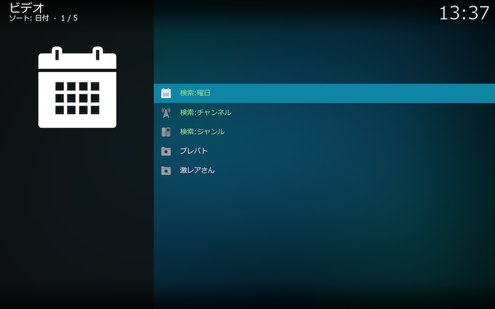
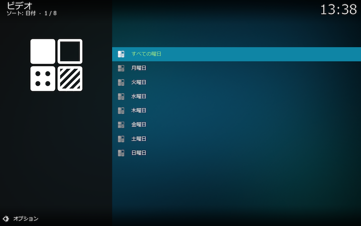
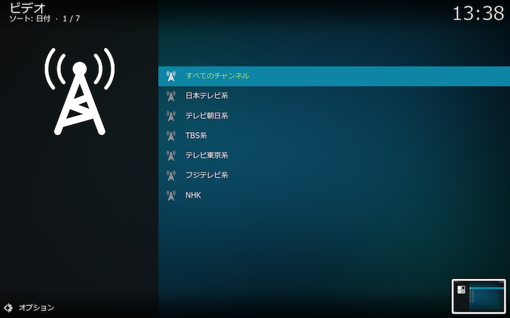
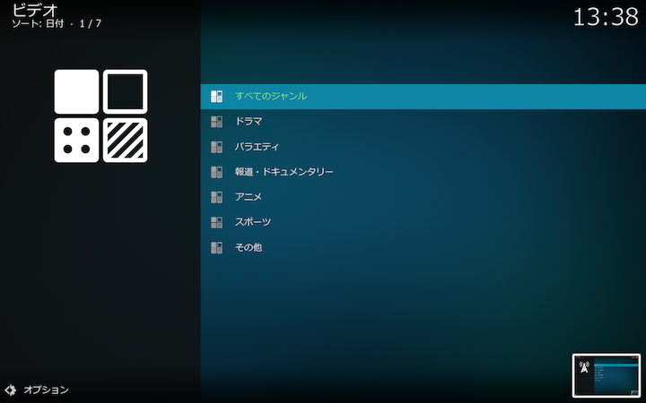
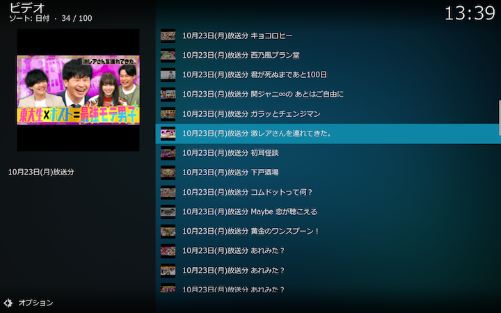
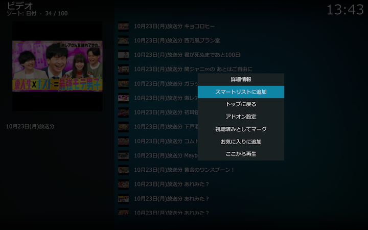
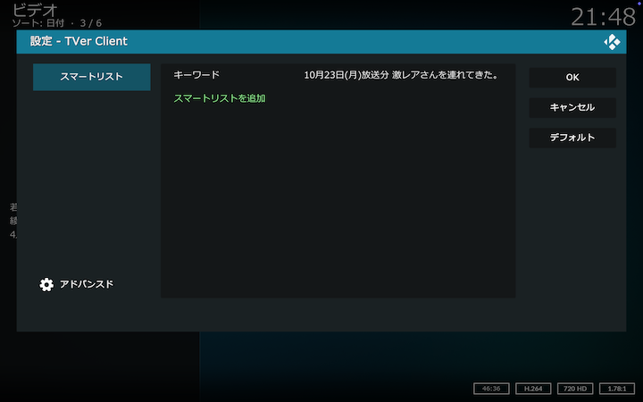
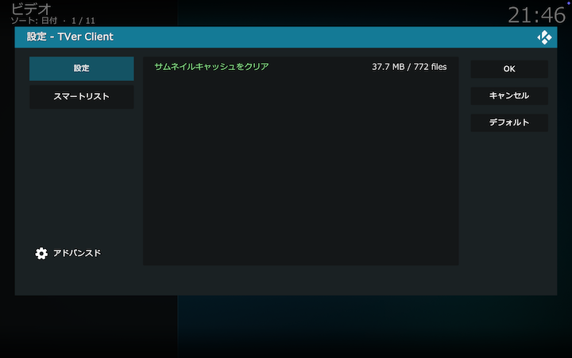
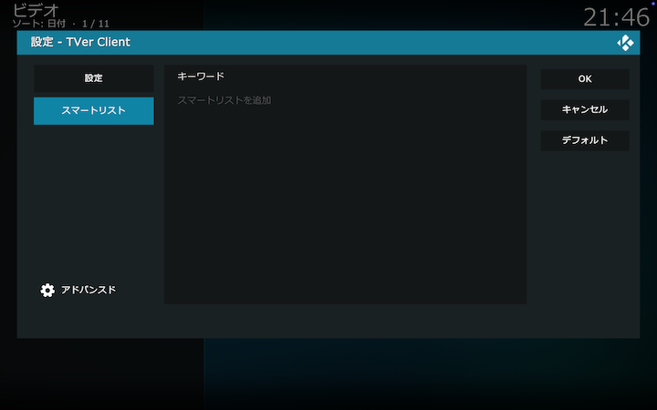

## Kodiアドオン：TVerクライアント

[TVer](https://tver.jp)を操作するためのKodiアドオンです。
macOSで動作検証しています。

 

## 目次

[トップ画面と検索](#トップ画面と検索)

[スマートリスト](#スマートリスト)

[アドオン設定-設定](#アドオン設定-設定)

[アドオン設定-スマートリスト](#アドオン設定-スマートリスト)

 

## トップ画面と検索

起動するとトップ画面が表示されます。

画面の各項目の内容は以下の通りです。

### 検索：曜日

番組を検索します。曜日→チャンネル→ジャンルの順に検索条件を設定します。まず曜日を選択します。

次にチャンネルを選択します。

次にジャンルを選択します。

検索結果が表示されます。

ここで見たい番組を選択すると、番組が再生されます（Kodiの設定によっては詳細情報が表示されます）。

### 検索：チャンネル

検索条件を、チャンネル→ジャンル→曜日の順に設定するほかは「検索：曜日」と同様です。

### 検索：ジャンル

検索条件を、ジャンル→チャンネル→曜日の順に設定するほかは「検索：曜日」と同様です。

 

## スマートリスト

トップ画面の下部にスマートリストのキーワードが表示されます。
このキーワードを登録しておくことで、トップ画面からワンクリックで設定したキーワードを含む番組を表示できます。

### スマートリストの登録

検索結果画面で、スマートリストに登録したい番組のコンテクストメニューから「スマートリストに追加」を選択してください。

選択した番組名をキーワードとするスマートリスト登録画面が開きます。

キーワードを適宜編集して「スマートリストを追加」ボタンをクリックしてください。
スマートリスト登録画面は「アドオン設定」から「スマートリスト」タブを選択して表示することもできます。

 

## アドオン設定-設定

コンテクストメニューから「アドオン設定」を選択してアドオン設定画面を表示します。「設定」タブを選択します。

画面の各項目の内容は以下の通りです。

### サムネイルキャッシュをクリア

アドオンが生成した番組のサムネイルの容量が表示されます。必要に応じてクリアしてください。

 

## アドオン設定-スマートリスト

コンテクストメニューから「アドオン設定」を選択してアドオン設定画面を表示します。「スマートリスト」タブを選択します。

画面の各項目の内容は以下の通りです。

### キーワード

トップ画面に表示するスマートリストのキーワードを設定します。
トップ画面からワンクリックで設定したキーワードを含む番組を表示できます。

### スマートリストを追加

設定したキーワードを含む番組を検索するボタンをトップページに追加します。
